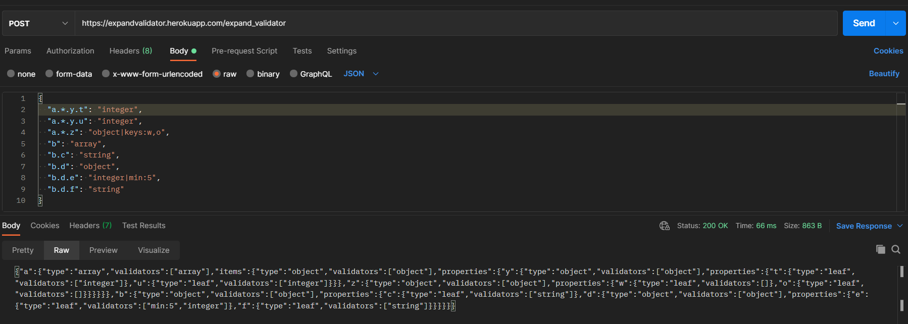

# Technical Exercise for first recruitment
## Backend
### Running with URL
``
https://expandvalidator.herokuapp.com/expand_validator
``
### Running it on localhost
The back end requires PHP to be launched on localhost.
```
php -S localhost:8000 -t public
```
at
``
http://localhost:8000/expand_validator
``
### Request using PostMan
```json
{
  "a.*.y.t": "integer",
  "a.*.y.u": "integer",
  "a.*.z": "object|keys:w,o",
  "b": "array",
  "b.c": "string",
  "b.d": "object",
  "b.d.e": "integer|min:5",
  "b.d.f": "string"
}
```

